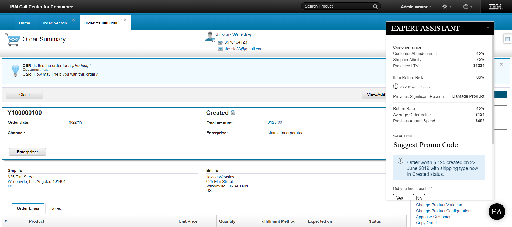
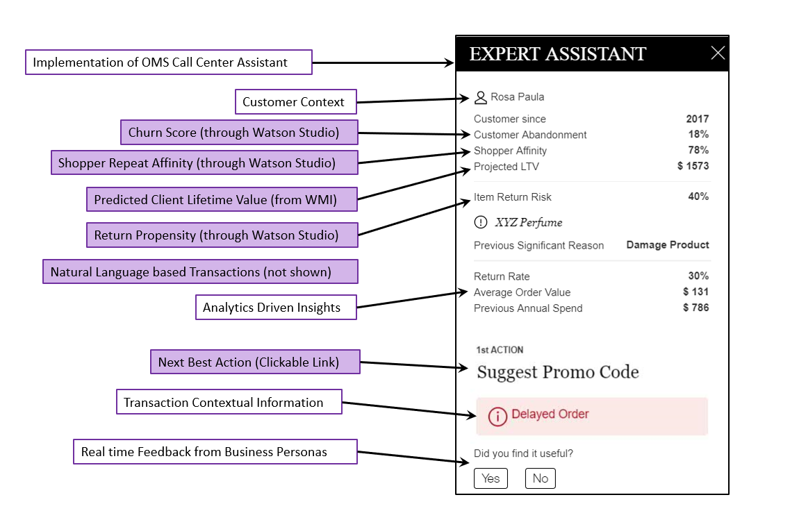
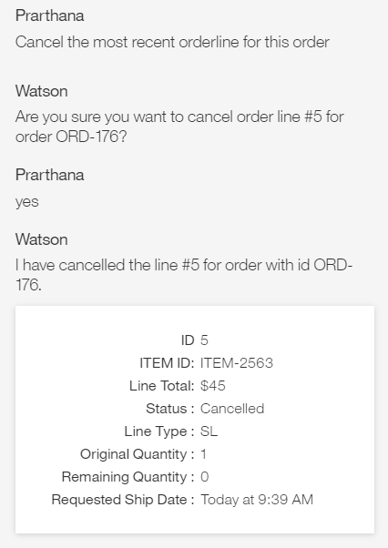

# Intelligent Call Center

Deep Understanding of customers' wants and needs are key to driving supply chain efficiencies and an enhanced customer experience.  The **Intelligent Call Center** solution equips Customer Care Representatives(CSRs) with deep customer insights in a natural language-based conversation interface to solve complex customer queries.
 
Let's review a typical day of a (CSR) where she opens up multiple tabs/applications to address a single query. She spends an enormous amount of time in a customer call thereby impacting the customer experience. This is especially detrimental during peak business hours where it is important to resolve issues quickly as CSRs are typically buried in a backlog of waiting calls. Wouldn't it impress the customer if the CSR proactively asks <i>"Are you calling about the accessories that you bought yesterday?"</i>, along with a warning that the order may be delayed.  Informing the customer and providing a discount voucher or an appeasement results in a much happier customer.

The heart of this improved customer experience is the IBM Supply Chain Business Assistant(SCBA) which infuses conversational AI capabilities into the IBM Sterling Call Center and enables intelligent orchestration of customer transactions across backend systems of records. It also surfaces recommendations, and next best actions based on the current customer context to enable quick and easy decision making for the CSRs. The SCBA appears as a pop-up over the  IBM Sterling Call Center Application and can be embedded into any other application just as a simple iFrame, with some sample insights as shown below.

&ensp;

<figure>
<html>
<head>
<meta name="viewport" content="width=device-width, initial-scale=1">
</head>
<body>

</body>
</html>
<figcaption>Fig.1</figcaption>
</figure>

&ensp;

The above screenshot is the **Order Summary Screen** in the Sterling Call Center Application where the Intelligent Assistant understands the customer context and pops up the relevant order related insights.  **Customer Abandonment** is the score to understand if the customer is likely to churn.  The **Projected  Life Time Value** is the projected revenue incurred by a similar customer over their lifetime. Based on these two insights, the CSR is better equipped to give relevant customer appeasements and/or upsell/cross-sell to influence the customer.

One very important insight that could help the business to avoid high product returns is the **Item Return Risk/Return Propensity Score** that identifies the probability of a specific purchased item being returned by the customer.  The **shopper affinity** is the affinity of the customer to shop again. The CSR can quickly understand the customers stickiness to a particular brand and help in upsell/cross-sell opportunities.

&ensp;

<figure>
<html>
<head>
<meta name="viewport" content="width=device-width, initial-scale=1">
</head>
<body>

</body>
</html>
<figcaption>Fig.2</figcaption>
</figure>

&ensp;

 **Return rate, Average Order value and Previous Annual Spend** are the analytical insights calculated based on the customer order history. All these insights aid in providing  relevant recommendations for the CSR to take the next best action. In the above scenario **Suggest Promo code** is appropriate as the *customer Life Time Value* is high, **Churn** is low, **Return rate** is also low and **Shopper affinity** is high. The CSR is prompted to retain the customer and influence more sales using a coupon or a promotion to the customer. 

Now, Lets look at how a Call center executive can use simple natural language commands to execute customer transactions across backend systems. A **Cancel Order** transaction would involve cancelling the order from the backend Order Management, updating the ERP,  along with other multiple systems of record.  The Supply Chain business Assistant can enable seamless orchestration of these transactions using one click actions, or natural language commands, making it a breeze for CSRs.

&ensp;

<figure>
<html>
<head>
<meta name="viewport" content="width=device-width, initial-scale=1">
</head>
<body>

</body>
</html>
<figcaption>Fig.3</figcaption>
</figure>

&ensp;

With this solution, businesses can
 
* Improve their customer understanding leading to higher customer satisfaction 
 
* Drive customer centric supply chain process optimization to increase the business revenue and minimize costs
 
* Reduce overall call time to increase the productivity of the customer service associates 

This solution is not just limited to Call Center executives, but also for Store Associates, and other customer facing business users to provide an amazing customer experience 

# Learn More

This was a high-level description of Intelligent Call Center.  Learn more about it and other Intelligent Call Center capabilities for developers at [IBM Developer](https://developer.ibm.com/components/sterling/)
